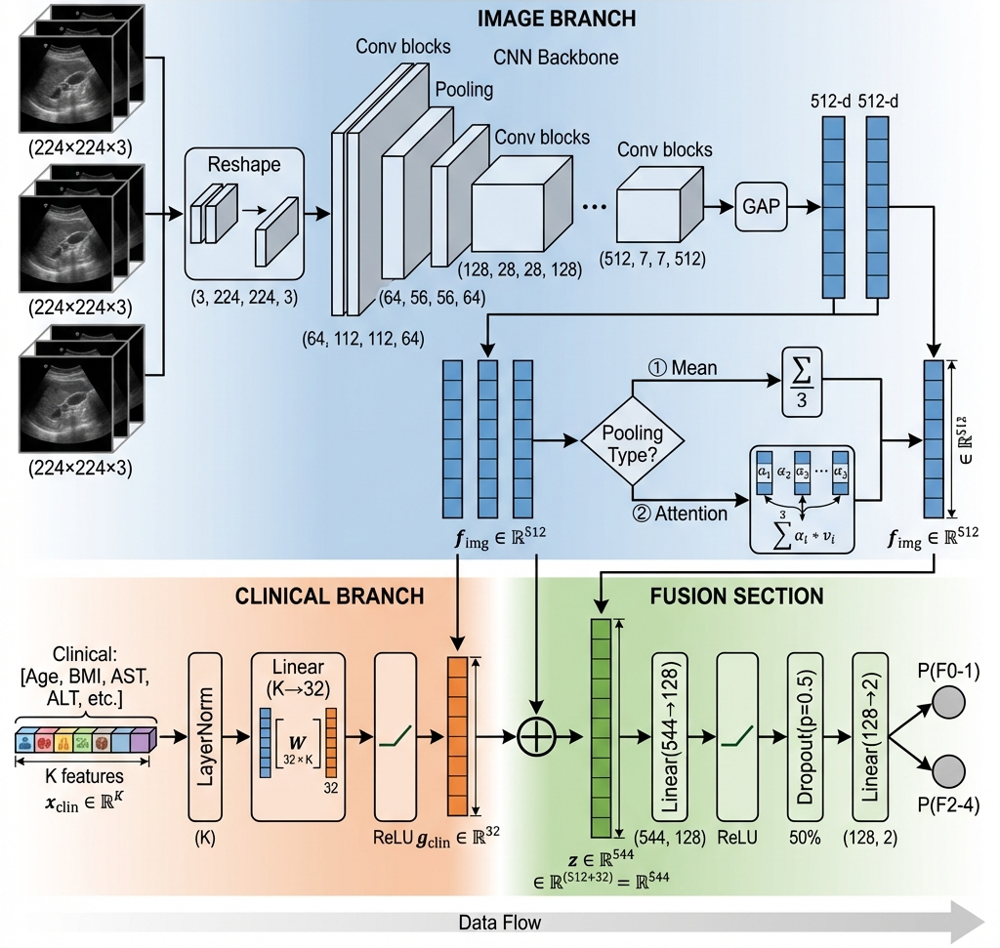

# Liver Fibrosis Classification

This project implements a deep learning framework for liver fibrosis classification using B-mode ultrasound images and clinical data. It supports single-stream models (B-mode only), dual-stream models (B-mode + Nakagami imaging), and multi-modal fusion models (B-mode + Clinical data).

## Method Overview

The framework provides three main architectural approaches:

1.  **Single Stream (A1/A2)**: Uses B-mode ultrasound images with either Mean Pooling or Attention Pooling.
2.  **Dual Stream**: Combines B-mode and Nakagami images using backbone feature extraction.
3.  **Clinical Fusion (C1/C2)**: Fuses B-mode image features with clinical variables (e.g., AST, ALT, PLT) using a multi-layer perceptron (MLP).

### Architectures

**General Architecture Overview:**


## Installation

### Prerequisites
- Linux OS (Recommended)
- Python 3.8+
- Anaconda / Miniconda

### Setup Environment

1. **Create and activate the environment:**
    ```bash
    conda create -n qus python=3.9
    conda activate qus
    ```

2. **Install dependencies:**
    ```bash
    pip install -r requirements.txt
    ```

## Dataset Structure

Ensure your data is organized as follows:

```
project_root/
├── data/
│   ├── bmode_full/           # B-mode images (png)
│   ├── nakagami_full/        # Nakagami images (png)
│   ├── annotations/
│   │   └── 175_clinical_5_variables.csv  # Clinical data & labels
│   └── ...
```

## Usage

### 1. Train Single Stream (B-mode Only)

**A1: Mean Pooling Model**
```bash
python train.py --model_type mean --backbone efficientnetv2_b2 --learning_rate 1e-3
```

**A2: Attention Pooling Model**
```bash
python train.py --model_type attention --backbone efficientnetv2_b2 --learning_rate 4e-4
```

### 2. Train Clinical Fusion (B-mode + Clinical)

**C1: Mean Pooling + Clinical**
```bash
python train_clinical.py --pooling mean --backbone efficientnetv2_b2 --learning_rate 1e-3
```

**C2: Attention Pooling + Clinical**
```bash
python train_clinical.py --pooling attention --backbone efficientnetv2_b2 --learning_rate 2e-4
```

### 3. Train Dual Stream (B-mode + Nakagami)

```bash
python train_dual_stream.py \
    --model_type mean \
    --backbone_bmode efficientnetv2_b0 \
    --backbone_nakagami efficientnetv2_b0 \
    --learning_rate 1e-5
```

### 4. Train Dual Stream + Clinical Fusion

```bash
python train_dual_stream_clinical.py \
    --pooling mean \
    --backbone_bmode efficientnetv2_b0 \
    --backbone_nakagami efficientnetv2_b0 \
    --learning_rate 1e-5
```

### 5. Schedulers

You can experiment with different learning rate schedulers using `train_clinical_scheduler.py`:

```bash
# Cosine Annealing (Default)
python train_clinical_scheduler.py --pooling mean --scheduler cosine

# Reduce on Plateau
python train_clinical_scheduler.py --pooling mean --scheduler plateau --scheduler_patience 5
```

## Training Arguments

Key arguments common across scripts:

| Argument | Description | Default |
| :--- | :--- | :--- |
| `--backbone` | CNN backbone (resnet18, efficientnetv2_b2, etc.) | `resnet18` |
| `--batch_size` | Training batch size | `16` |
| `--num_epochs` | Max training epochs | `40` |
| `--no_cv` | Disable 5-fold cross-validation (train/val split only) | `False` |
| `--device` | Compute device (`cuda` or `cpu`) | Auto-detect |
| `--log_dir` | TensorBoard log directory | `runs/...` |

## Results

Training logs and TensorBoard events are saved in the `logs/` and `runs/` directories respectively.